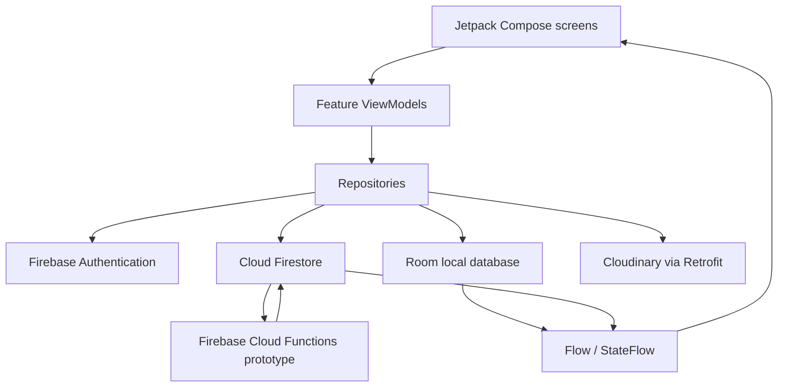

# Paws & Hearts

**A community-focused Android application for pet adoption, social interaction, and animal-support activities.**

[](https://kotlinlang.org/)
[](https://developer.android.com/)
[](https://developer.android.com/compose)
[](https://firebase.google.com/)

Paws & Hearts is an academic team project built to connect pet lovers, support pet-adoption listings, and provide community features in one Android application. The project uses a feature-oriented, MVVM-style structure with Jetpack Compose, Firebase, Room, and Cloudinary.

> This repository is a student project and is not a production-ready animal-welfare or payment platform.

## Design

[View the original Figma design](https://www.figma.com/design/UwuzUCmsJjyzOvyAOjTwII/UI?node-id=0-1&p=f&t=ih4SgHjN8IlcIb1s-0)

## Implemented features

### Authentication and profiles

- Register and sign in with email/password.
- Sign in with a Google account.
- Maintain authenticated navigation and logout state.
- View and update profile information, including name, email, phone number, address, and avatar.
- Follow and unfollow other users.
- Cache profile data locally with Room.

### Community feed

- Create text and image posts.
- Receive real-time post updates from Firestore.
- Search community posts.
- Like and comment on posts.
- View a personal post list.
- Include a Firestore-based notification prototype for post interactions.

### Pet adoption

- Create adoption listings with pet details and an image.
- Browse and search available adoption posts.
- Filter listings by pet attributes such as species, age, and location.
- Open a detailed view with health, adoption-requirement, and contact information.

### Community activities

- Browse real-time activity listings.
- View activity details and register to participate.
- Provide create, update, and delete controls for users marked as administrators.

### Messaging

- Send and receive text messages in real time.
- Share images, files, and locations inside conversations.
- Persist messages locally with Room.
- Track outgoing messages with `SENDING`, `SENT`, and `FAILED` states.
- Synchronize Firestore messages into the local Room database.

### Application settings

- Switch between light and dark themes.
- Persist the selected theme with Preferences DataStore.

## Architecture

The project is a single Android application module organized by feature. It follows an MVVM-style data flow using manually created `ViewModelProvider.Factory` classes.



### Chat synchronization flow

Chat is the clearest example of the local/remote data flow in the project.

```text
Outgoing message
  -> save to Room as SENDING
  -> send to Firestore with the same message ID
  -> update Room to SENT
  -> update Room to FAILED if the remote write fails

Incoming message
  -> Firestore snapshot listener
  -> upsert into Room
  -> Room Flow
  -> ViewModel StateFlow
  -> Compose UI
```

Using the same message ID locally and remotely prevents a successful message from appearing twice after synchronization.

## Tech stack

| Area | Technologies |
| --- | --- |
| Language | Kotlin 1.9.24 |
| UI | Jetpack Compose, Material 3, Navigation Compose |
| Architecture | MVVM-style, Repository pattern, ViewModel, StateFlow/Flow |
| Asynchronous work | Kotlin Coroutines |
| Local persistence | Room, Preferences DataStore |
| Authentication | Firebase Authentication, Google Sign-In |
| Remote data | Cloud Firestore |
| Backend automation | Firebase Cloud Functions prototype, TypeScript |
| Media upload | Cloudinary, Retrofit, Gson |
| Image loading | Coil |
| Build | Gradle Kotlin DSL, Version Catalog, KSP |

## Project structure

```text
Paws-Hearts/
├── app/src/main/java/com/example/pawshearts/
│   ├── auth/           # Registration, login, Google Sign-In, auth state
│   ├── profile/        # User profile and follow system
│   ├── post/           # Community posts, likes, and comments
│   ├── adopt/          # Pet-adoption listings and filters
│   ├── activities/     # Community activities and registrations
│   ├── messages/       # Firestore + Room messaging flow
│   ├── notification/   # In-app notification center
│   ├── donate/         # Demonstration donation-information screens
│   ├── setting/        # Persistent theme preference
│   ├── image/          # Cloudinary and Retrofit integration
│   ├── data/local/     # Room profile cache
│   ├── navmodel/       # Compose navigation graph and routes
│   └── ui/theme/       # Material 3 theme
├── functions/src/      # Firebase Cloud Functions written in TypeScript
├── gradle/             # Version Catalog and Gradle Wrapper files
├── firebase.json       # Firebase Functions and Emulator configuration
└── README.md
```

## Getting started

### Prerequisites

- Android Studio with JDK 17 or later
- Android SDK 36
- An emulator or physical device running Android 7.0 (API 24) or later
- A Firebase project
- A Cloudinary account with an unsigned upload preset
- Node.js 22 and Firebase CLI only if you want to deploy the Cloud Functions

### 1. Clone the repository

```bash
git clone https://github.com/Le-Van-Khoicw/Paws-Hearts.git
cd Paws-Hearts
```

Open the project in Android Studio and allow Gradle to synchronize the dependencies.

### 2. Configure Firebase

1. Create a Firebase project.
2. Register an Android application with package name `com.example.pawshearts`.
3. Enable **Email/Password** and **Google** in Firebase Authentication.
4. Create a Cloud Firestore database and configure appropriate Security Rules for your environment.
5. Download your Firebase `google-services.json` file and place it at:

```text
app/google-services.json
```

For Google Sign-In, generate the signing fingerprints and register the required SHA fingerprint in Firebase:

```bash
./gradlew signingReport
```

On Windows:

```powershell
.\gradlew.bat signingReport
```

Download `google-services.json` again after updating the Firebase Android configuration.

The current source also contains a project-specific `default_web_client_id`. Replace it with the client ID generated for your Firebase project before testing Google Sign-In.

### 3. Configure Cloudinary

Create a Cloudinary cloud and an unsigned upload preset. The current student version reads the cloud name and preset from the media-upload source files:

- `app/src/main/java/com/example/pawshearts/image/CloudinaryService.kt`
- `app/src/main/java/com/example/pawshearts/image/ImageRepository.kt`
- the feature repository implementations that upload media

Replace the existing project-specific values with your own. For a public or production project, move these values into local build configuration instead of keeping them in source code, and restrict the upload preset in the Cloudinary dashboard.

### 4. Build and run the Android app

Build a debug APK:

```bash
./gradlew assembleDebug
```

On Windows:

```powershell
.\gradlew.bat assembleDebug
```

Then run the `app` configuration from Android Studio on an emulator or connected Android device.

### 5. Build the Firebase Cloud Functions prototype

The repository contains TypeScript functions for notification and follow-event experiments in `functions/src/index.ts`.

```bash
cd functions
npm ci
npm run build
cd ..

firebase login
firebase use --add
firebase deploy --only functions
```

Select your own Firebase project when running `firebase use --add`; do not deploy to the project ID stored by another contributor. The current Android and Cloud Functions notification schemas still require alignment before this flow should be treated as complete.

## Optional: Firebase Emulator Suite

The application contains Auth and Firestore emulator configuration, but real Firebase services are used by default. To use the local emulators:

1. Change `useEmulator` to `true` in `MyApplication.kt`.
2. Start the configured services:

```bash
firebase emulators:start --only auth,firestore,functions
```

Android Emulator traffic is routed to the host through `10.0.2.2`. A physical Android device must use the development machine's reachable LAN address instead.

## Validation commands

Run local unit tests:

```bash
./gradlew testDebugUnitTest
```

Current automated-test coverage is minimal. The existing instrumented-test template also needs its package name corrected before it can validate the application.

## Known limitations

- Password-reset UI is not implemented.
- The donation section is a static demonstration screen and does not process or verify payments.
- The Android notification reader and Cloud Functions currently use different Firestore collection schemas and require integration cleanup.
- Chat stores failed-message state but does not yet provide an automatic background retry queue.
- Firebase and Cloudinary configuration is currently tied to the original student environment and should be replaced before reuse.
- The repository does not currently include production Firestore rules, deployment hardening, or complete automated-test coverage.

## Contributors

Paws & Hearts was developed as an academic team project. See the complete [contributors list](https://github.com/Le-Van-Khoicw/Paws-Hearts/graphs/contributors).
